# lbrydseed

This is a simple graphical interface that allows us
to download the latest claims from a list of channels in the LBRY network.
We can also do other operations like delete individual claims,
clean up claims from channels, list all downloaded claims,
show our supports, and show an estimate of our seeding ratio.

It uses the [lbrytools](https://github.com/belikor/lbrytools) library
to add more functionality to the basic `lbrynet` daemon.

This program is released as free software under the MIT license.

## Installation

You must have Python installed. Most Linux distributions come with Python
ready to use; for Windows you may need to get the official package,
or a full featured distribution such as Anaconda.
In Windows, make sure the Python executable is added to the `PATH`
so that it can be launched from anywhere in your system.

You must have the LBRY Desktop application or the `lbrynet` client.
Get them from [lbry.com/get](https://lbry.com/get).

### Requisites

The program uses the `tkinter` module which makes the Tk graphical libraries
available in Python.
These libraries are normally distributed together with Python
although you may have to verify that they are actually installed:
```sh
sudo apt install python-tk
sudo apt install python3-tk  # for Ubuntu
sudo pacman -S tk  # for Arch
```

The `requests` library is necessary to communicate
with the running LBRY daemon; the `emoji` module is used to clean up emojis
from the output:
```sh
python -m pip install --user requests emoji
python3 -m pip install --user requests emoji  # for Ubuntu
```

You can install these and other libraries by using `pip`,
the Python package manager. If this is not installed it can be installed:
```sh
sudo apt install python-pip
sudo apt install python3-pip  # for Ubuntu
sudo pacman -S python-pip  # for Arch
```

### Windows

On Windows, most prerequisites can be installed using `pip`,
although a big distribution like Anaconda may be easier to use,
as it contains many packages already.

### lbrytools

You must have the [lbrytools](https://github.com/belikor/lbrytools)
library.

Clone this repository using Git with `--recurse-submodules`
to include `lbrytools` with the rest of the code:
```sh
git clone --recurse-submodules https://github.com/belikor/lbrydseed
```

After cloning you should have the following structure:
```
lbrydseed/
    dseed.py
    lbrytools/
    lbseed/
```

### Running in place

You can run the `dseed.py` program where it is.
```sh
python dseed.py
```

If you place `dseed.py` somewhere else, make sure it is always
next to `lbrytools/` and `lbseed/`.

### Updating

To update the program's code, make sure you are in the `lbrydseed/` directory:
```sh
cd lbrydseed/
git pull
```

The [lbrytools](https://github.com/belikor/lbrytools) library
is hosted in its own repository,
and is used in this program as a submodule.
To update this component:
```sh
git submodule update --remote --rebase lbrytools/
```

If this causes merging errors you may have to update the submodule manually:
```sh
cd lbrydseed/lbrytools/
git fetch
git reset --hard FETCH_HEAD
```

### System wide installation

This is optional, and only required if you want to have the libraries
available in your entire system.

Copy the `lbrytools` directory (the one with an `__init__.py`)
and the [`lbseed`](./lbseed) directory (also with an `__init__.py`),
and place them inside a `site-packages` directory that is searched by Python.
```
/home/user/.local/lib/python3.8/site-packages/lbrytools
/home/user/.local/lib/python3.8/site-packages/lbseed
```

or in a system-wide directory:
```
/usr/local/lib/python3.8/dist-packages/lbrytools
/usr/local/lib/python3.8/dist-packages/lbseed
/usr/lib/python3/dist-packages/lbrytools
/usr/lib/python3/dist-packages/lbseed
```

Then place `dseed.py` wherever you want, and run it from there.

### Environmental variables

This is optional. Instead of moving the `lbrytools` and `lbseed` libraries,
simply add them to the `PYTHONPATH` environmental variable.
We must add the parent directory containing these libraries.
For example, if
```
/top1/
    lbseed/
/top2/pkg/
    lbrytools/
```

The variable will be
```sh
PYTHONPATH="/top1:/top2/pkg:$PYTHONPATH"
```

### Optional

The `matplotlib` library is optional, and only needed
to plot the histograms in the `"Seeding ratio"` page.
```sh
python -m pip install --user matplotlib
python3 -m pip install --user matplotlib  # for Ubuntu
```

## Setuptools

We can use `setuptools` with its standard options to generate
a directory (`build/lib/`) or archive (`dist/`) with the necessary files:
```sh
python setup.py build
python setup.py sdist
python setup.py clean
python setup.py clean --all
```

## Usage

Make sure the `lbrynet` daemon is running either by launching
the full LBRY Desktop application, or by starting the console `lbrynet`
program.
```sh
lbrynet start
```

Double click `dseed.py` or open a Python console and run it from the terminal.
```sh
python dseed.py
```

Enter the name of the channels, and a number of claims to download for each,
then press `"Download channel claims"`.

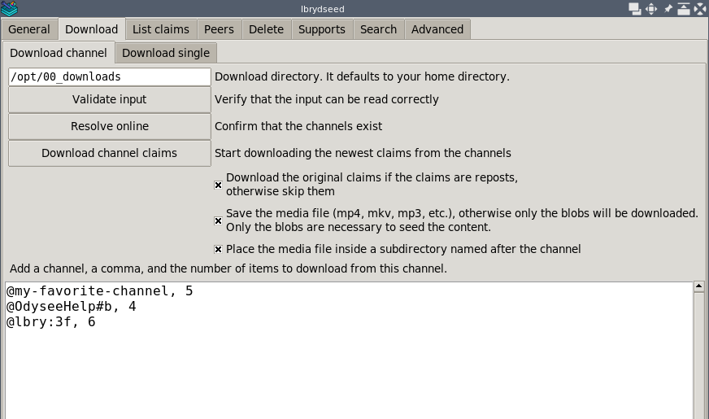

Enter the name or claim ID of various claims,
and then press `"Download claims"`.

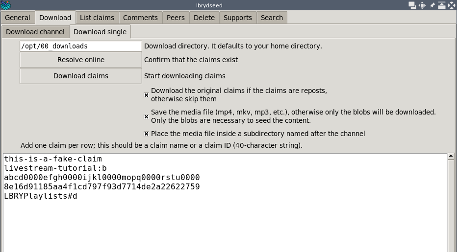

Press `"List download claims"` to display all claims downloaded to the system.

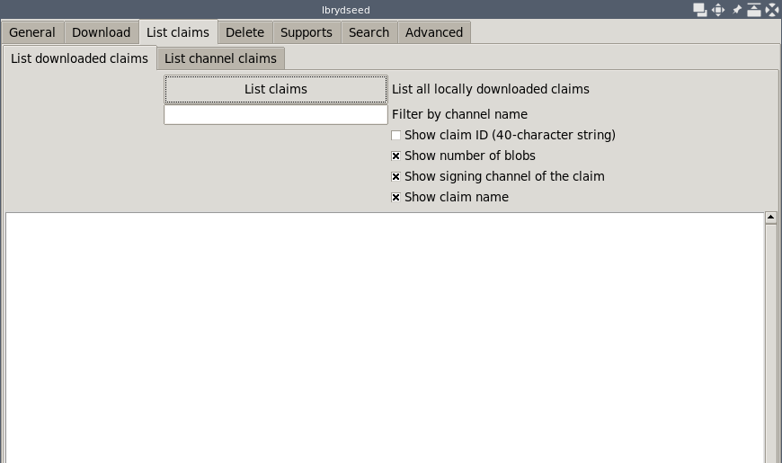

Press `"List invalid claims"` to display all invalid claims,
previously downloaded but no longer available online.

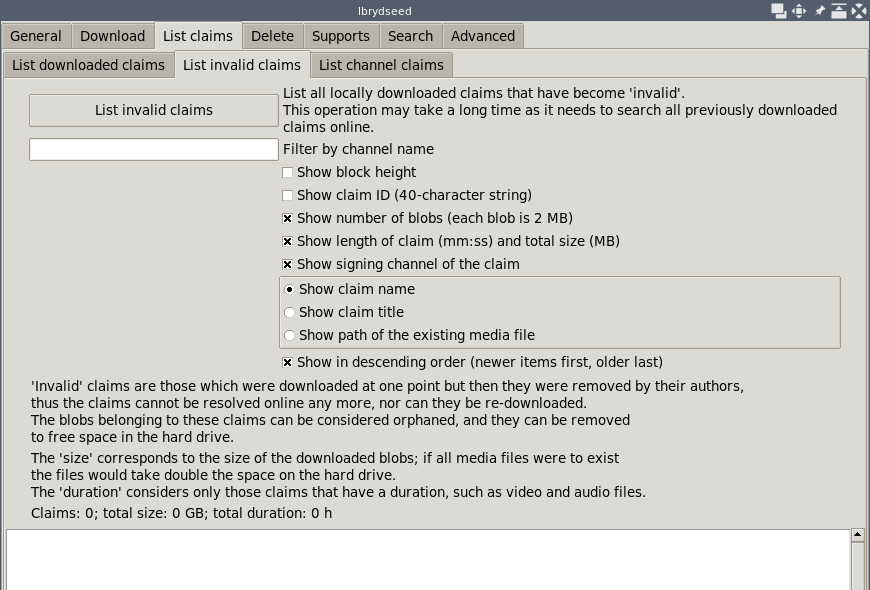

Press `"List channel claims"` to display all claims from a single channel.

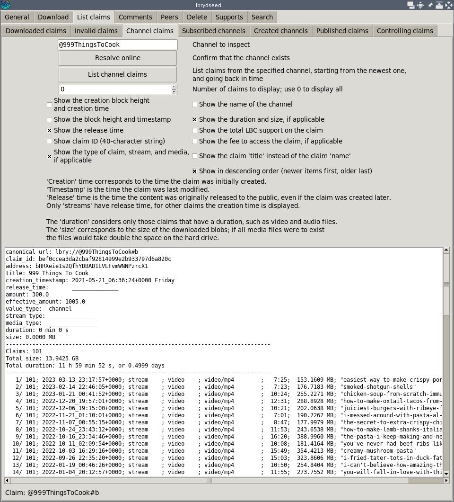

Enter the name or claim ID of various claims, then press `"Delete claims"`.

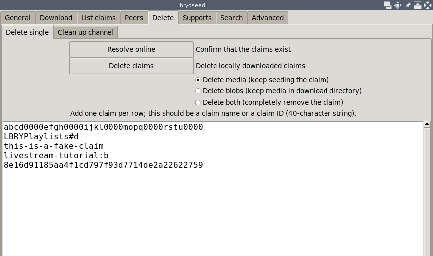

Enter the name of the channels, and a number of claims to keep for each,
then press `"Clean up claims"`.

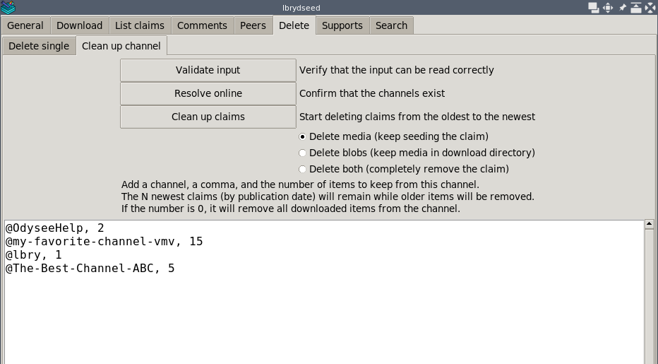

Press `"List supports"` to show claims that we support with LBC.

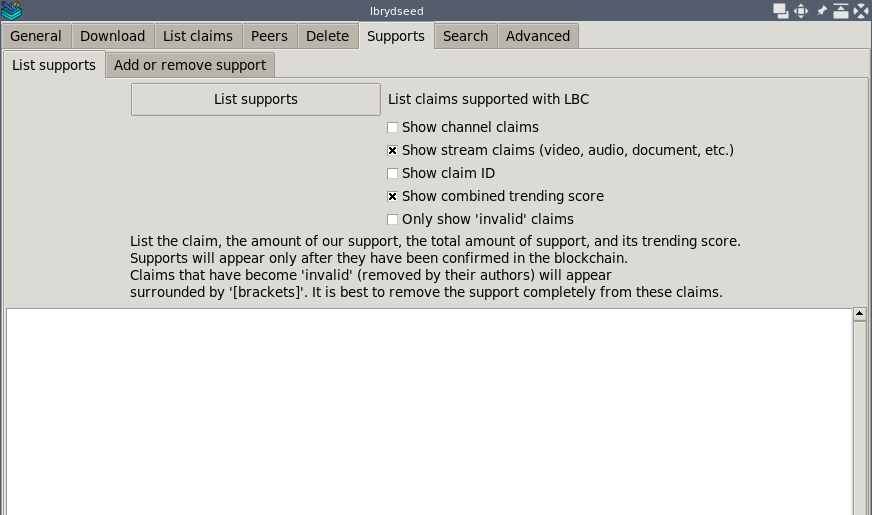

Enter the name or claim ID of various claims (it can be any type of claim
such as videos and channels), a number,
and then press `"Add or remove support"`.

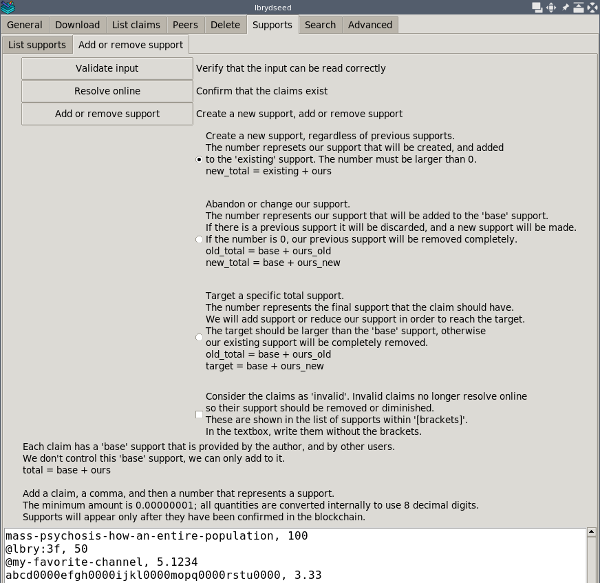

Press `"Show trending claims"` to show the claims that are trending
on the network at the moment.

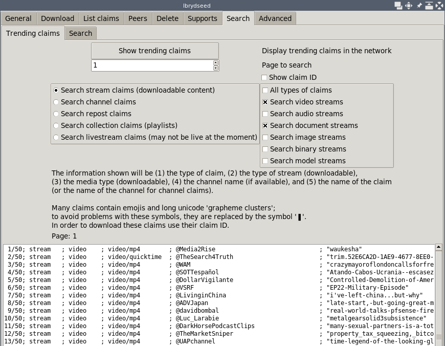

Press `"Search"` to search the string, and tags, if any.
At the moment, the search functionality is very basic, so using simple words
is better than long sentences.

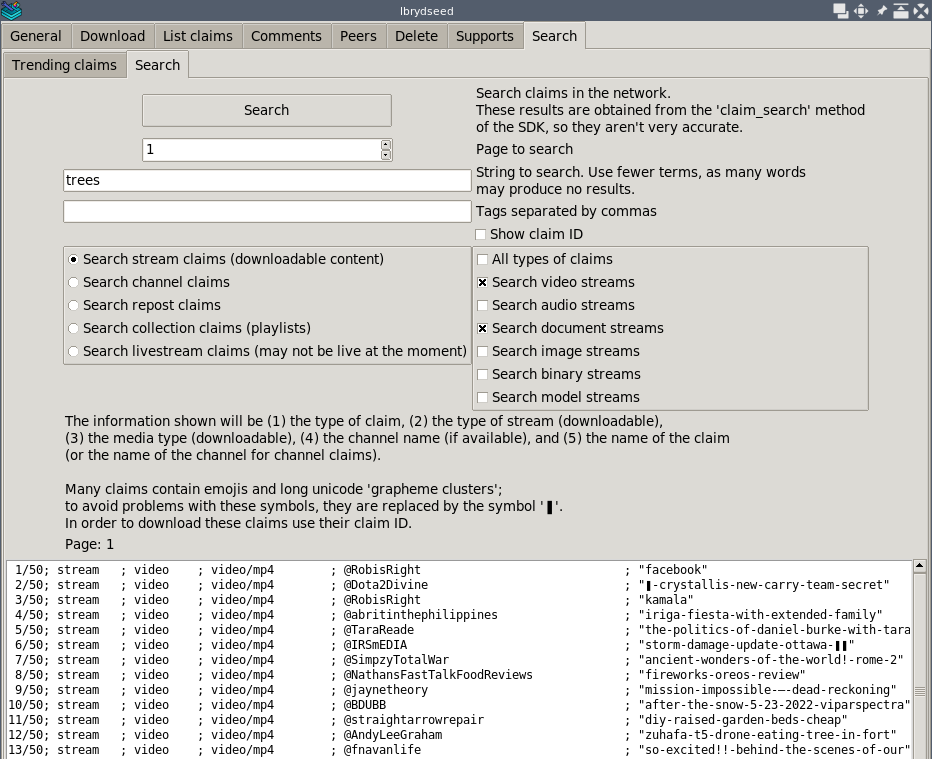

Press `"Display seeding ratio"` to show an estimate of the blobs uploaded
and downloaded.

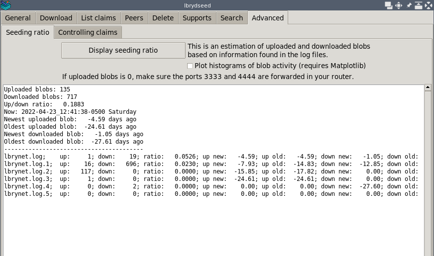

Press `"Display controlling claims"` to show our published claims,
and whether they are "controlling", meaning that they have the highest bid
for their name.


## Development

Ideally, this collection of tools can be merged into the official
LBRY sources so that everybody has access to them.
Where possible, the tools should also be available from a graphical
interface such as the LBRY Desktop application.
* [lbryio/lbry-sdk](https://github.com/lbryio/lbry-sdk)
* [lbryio/lbry-desktop](https://github.com/lbryio/lbry-desktop)

If you wish to support this work you can send a donation:
```
LBC: bY38MHNfE59ncq3Ch3zLW5g41ckGoHMzDq
XMR: 8565RALsab2cWsSyLg4v1dbLkd3quc7sciqFJ2mpfip6PeVyBt4ZUbZesAAVpKG1M31Qi5k9mpDSGSDpb3fK5hKYSUs8Zff
```
