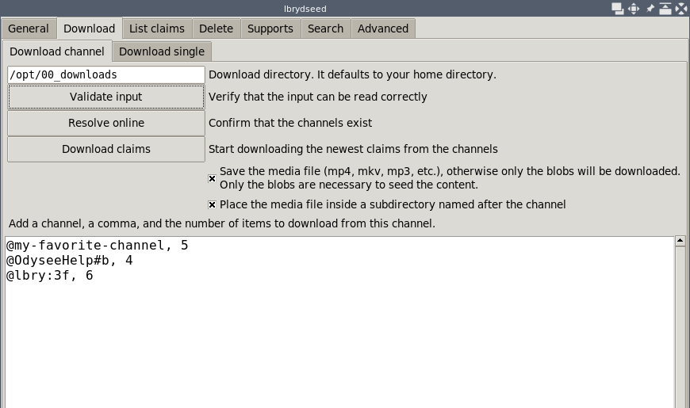
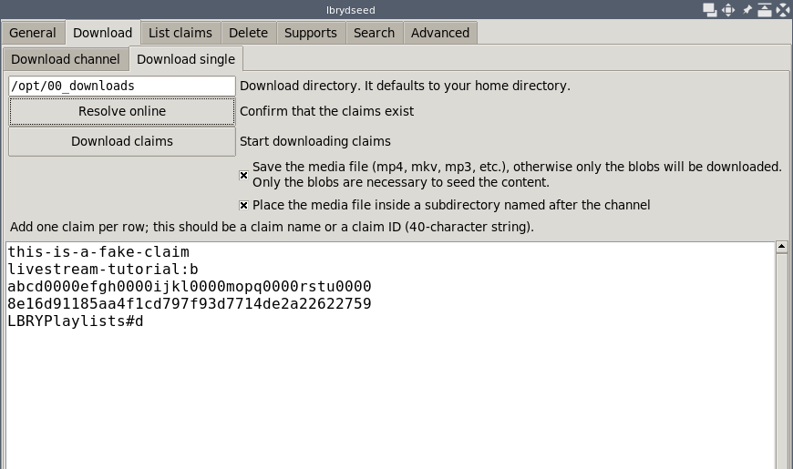
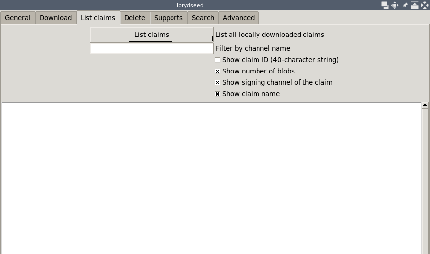
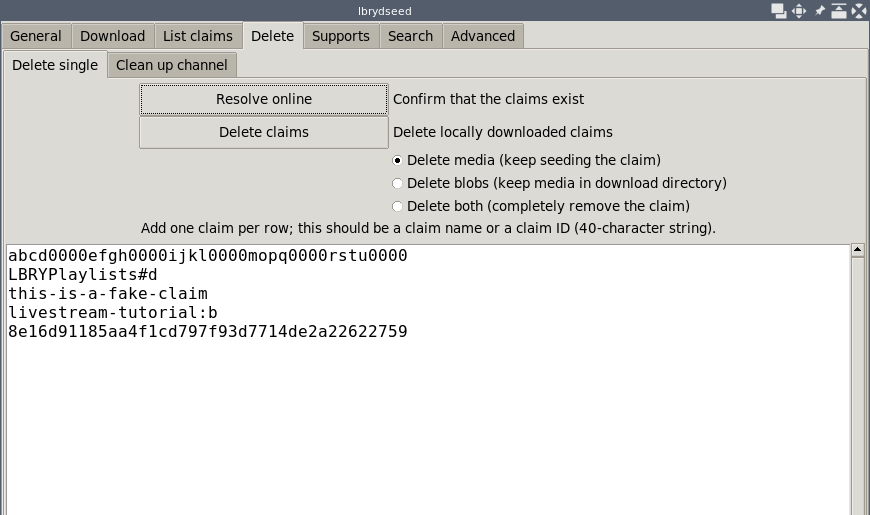
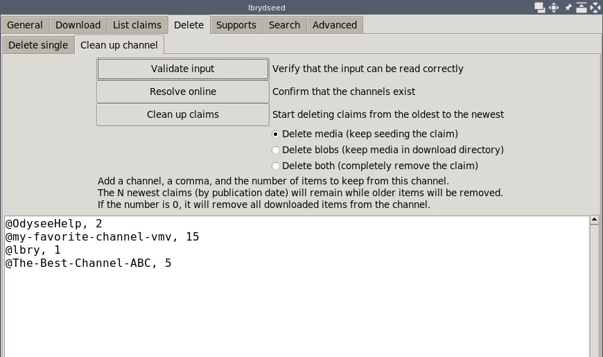
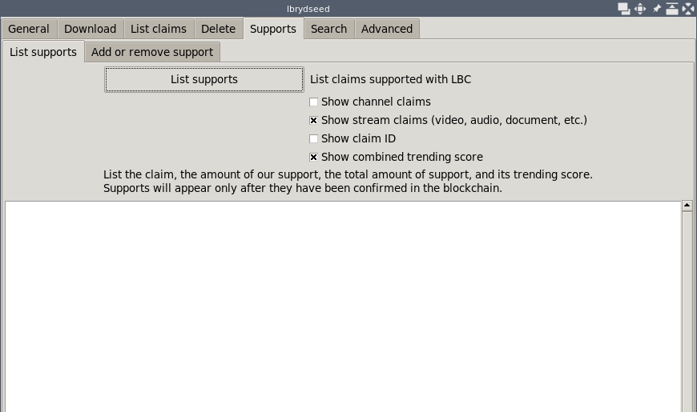
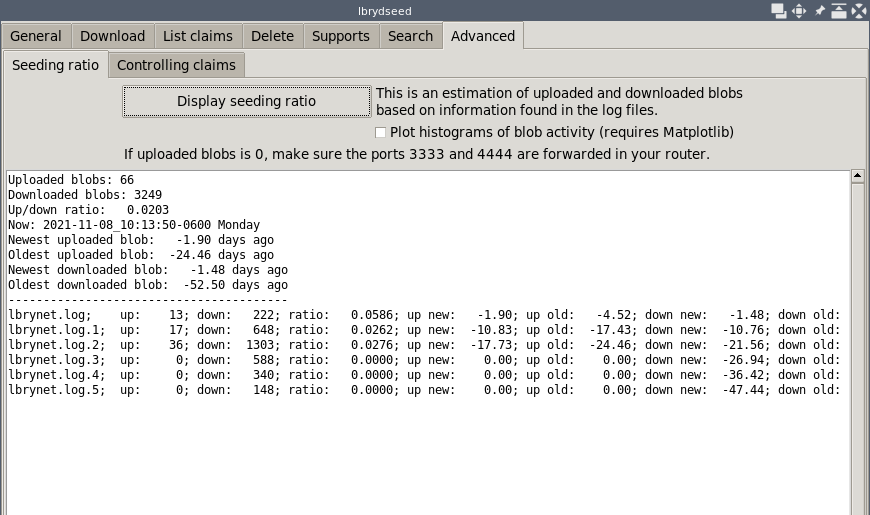

# lbrydseed

This is a simple graphical interface that allows us
to download the latest claims from a list of channels in the LBRY network.
We can also do other operations like deleting individual claims,
cleaning up claims from channels, listing all downloaded claims,
showing our supports, and estimating our seeding ratio.

It uses the [lbrytools](https://github.com/belikor/lbrytools) library
to add more functionality to the basic `lbrynet` daemon.

This program is released as free software under the MIT license.

## Installation

You must have Python installed. Most Linux distributions come with Python
ready to use; for Windows you may need to get the official package,
or a full featured distribution such as Anaconda.

You must have the LBRY Desktop application or the `lbrynet` client.
Get them from [lbry.com/get](https://lbry.com/get).

You must also have the [lbrytools](https://github.com/belikor/lbrytools/lbrytools)
library (the internal `lbrytools/` directory that has the `__init__.py`).

Clone this repository with `--recurse-submodules` to include `lbrytools`
with the rest of the code:
```sh
git clone --recurse-submodules https://github.com/belikor/lbrydseed
```

After cloning you should have the following structure:
```
lbrydseed/
    dseed.py
    lbrytools/
    lbseed/
```

You can run the `dseed.py` program where it is.
```sh
python dseed.py
```

If you place `dseed.py` somewhere else, make sure it is always
next to `lbrytools/` and `lbseed/`.

### System wide installation

This is optional, and only required if you want to have the libraries
available in your entire system.

Copy the `lbrytools` directory (the one with an `__init__.py`)
and the [`lbseed`](./lbseed) directory (also with an `__init__.py`),
and place them inside a `site-packages` directory that is searched by Python.
```
/home/user/.local/lib/python3.8/site-packages/lbrytools
/home/user/.local/lib/python3.8/site-packages/lbseed
```

or in a system-wide directory:
```
/usr/local/lib/python3.8/dist-packages/lbrytools
/usr/local/lib/python3.8/dist-packages/lbseed
/usr/lib/python3/dist-packages/lbrytools
/usr/lib/python3/dist-packages/lbseed
```

Then place `dseed.py` wherever you want, and run it from there.

### Environmental variables

This is optional. Instead of moving the `lbrytools` and `lbseed` libraries,
simply add them to the `PYTHONPATH` environmental variable.
We must add the parent directory containing these libraries.
For example, if
```
/top1/
    lbseed/
/top2/pkg/
    lbrytools/
```

The variable will be
```sh
PYTHONPATH="/top1:/top2/pkg:$PYTHONPATH"
```

### Optional

The Matplotlib library is optional, and only needed
to plot the histograms in the `"Seeding ratio"` page.

## Setuptools

We can use `setuptools` with its standard options to generate
a directory (`build/lib/`) or archive (`dist/`) with the necessary files:
```sh
python setup.py build
python setup.py sdist
python setup.py clean
python setup.py clean --all
```

## Usage

Make sure the `lbrynet` daemon is running either by launching
the full LBRY Desktop application, or by starting the console `lbrynet`
program.
```sh
lbrynet start
```

Double click `dseed.py` or open a Python console and run it from the terminal.
```sh
python dseed.py
```

Enter the name of the channels, and a number of claims to download for each,
then press `"Download claims"`.



Enter the name or claim ID of various claims,
and then press `"Download claims"`.



Press `"List claims"` to display all downloaded claims in the system.



Enter the name or claim ID of various claims, then press `"Delete claims"`.



Enter the name of the channels, and a number of claims to keep for each,
then press `"Clean up claims"`.



Press `"List supports"` to show claims that we support with LBC.



Press `"Display seeding ratio"` to show an estimate of the blobs uploaded
and downloaded.




## Development

Ideally, this collection of tools can be merged into the official
LBRY sources so that everybody has access to them.
Where possible, the tools should also be available from a graphical
interface such as the LBRY Desktop application.
* [lbryio/lbry-sdk](https://github.com/lbryio/lbry-sdk)
* [lbryio/lbry-desktop](https://github.com/lbryio/lbry-desktop)

If you wish to support this work you can send a donation:
```
LBC: bY38MHNfE59ncq3Ch3zLW5g41ckGoHMzDq
XMR: 8565RALsab2cWsSyLg4v1dbLkd3quc7sciqFJ2mpfip6PeVyBt4ZUbZesAAVpKG1M31Qi5k9mpDSGSDpb3fK5hKYSUs8Zff
```
