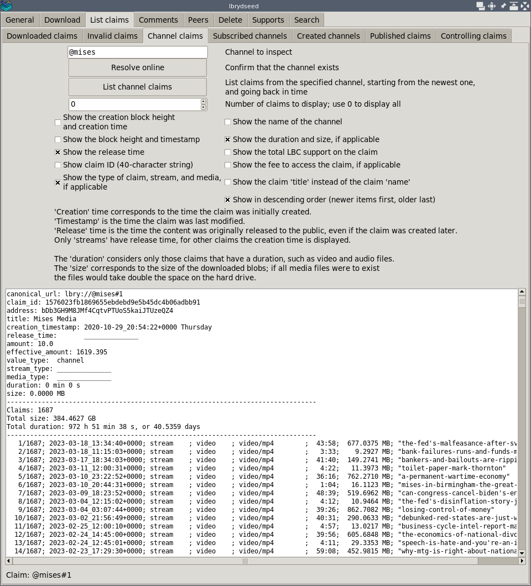

# lbrydseed

## Content

- [Introduction](#introduction)
- [Installation](#installation)
- [Usage](#usage)
- [Development](#development)

## Introduction

This is a simple graphical interface that allows us
to do many operations with multiple claims and channels in the LBRY network,
including:
- download individual claims or the latest claims from a list of channels
- list all claims belonging to a channel, and the latest claims
  in our subscribed channels
- list all our created channels and our published claims
- list all our downloaded claims
- show information on the peers that host the content of a channel
  in the network
- delete multiple downloaded claims, individually or by channel
- show our LBC supports, and change or remove these supports
- search trending claims, and search by keyword
- show an estimate of our seeding ratio

It uses the [lbrytools](https://github.com/belikor/lbrytools) library
to add more functionality to the basic `lbrynet` daemon.

This program is released as free software under the MIT license.



[Go back to _Content_](#content)

## Installation

Use Git to clone this repository with `--recurse-submodules`
to include `lbrytools` with the rest of the code:
```sh
git clone --recurse-submodules https://github.com/belikor/lbrydseed
```

After cloning you should have the following structure:
```
lbrydseed/
    dseed.py
    lbrytools/
    lbseed/
```

If you place `dseed.py` somewhere else, make sure it is always
next to `lbrytools/` and `lbseed/`.

See [_installation_](doc/installation.md) for more information
on the dependencies.

[Go back to _Content_](#content)

## Usage

Make sure the `lbrynet` daemon is running either by launching
the full LBRY Desktop application, or by starting the console `lbrynet`
program:
```sh
lbrynet start
```

Double click `dseed.py` or open a Python console and run it from the terminal:
```sh
python dseed.py
```

See [_usage_](doc/usage.md) for more information on each page
in the program.

[Go back to _Content_](#content)

## Development

Ideally, this collection of tools can be merged into the official
LBRY sources so that everybody has access to them.
Where possible, the tools should also be available from a graphical
interface such as the LBRY Desktop application.
* [lbryio/lbry-sdk](https://github.com/lbryio/lbry-sdk)
* [lbryio/lbry-desktop](https://github.com/lbryio/lbry-desktop)

If you wish to support this work you can send a donation:
```
LBC: bY38MHNfE59ncq3Ch3zLW5g41ckGoHMzDq
XMR: 8565RALsab2cWsSyLg4v1dbLkd3quc7sciqFJ2mpfip6PeVyBt4ZUbZesAAVpKG1M31Qi5k9mpDSGSDpb3fK5hKYSUs8Zff
```

[Go back to _Content_](#content)
