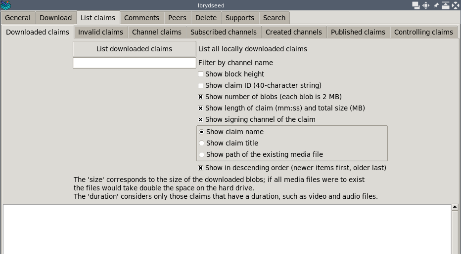
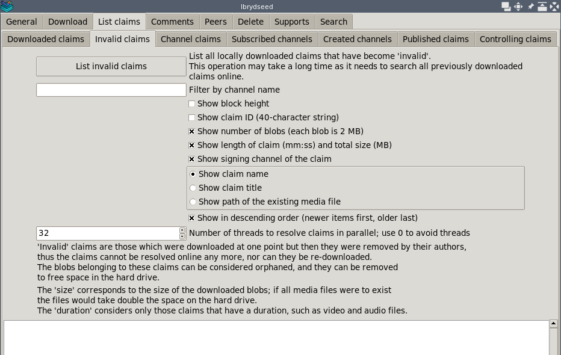
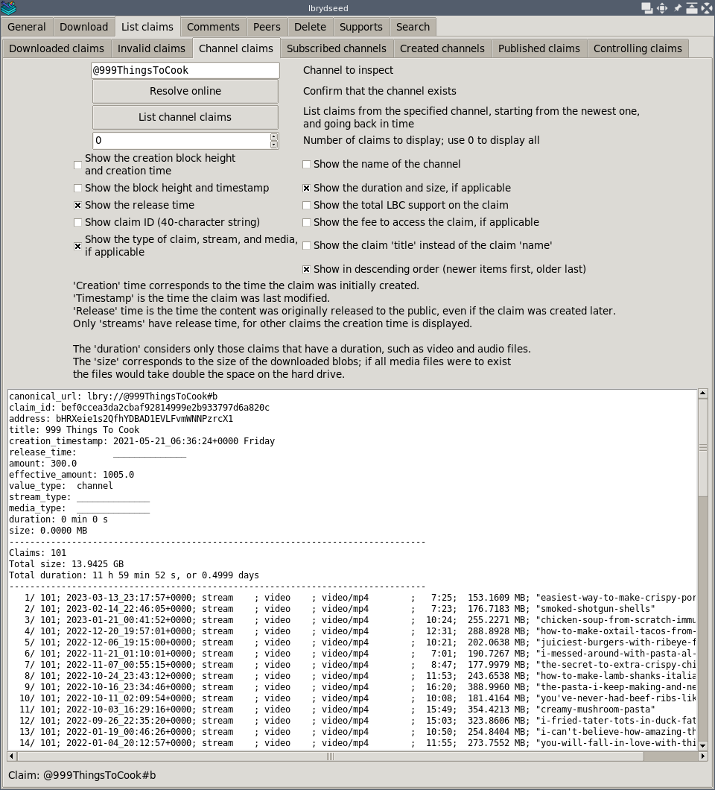
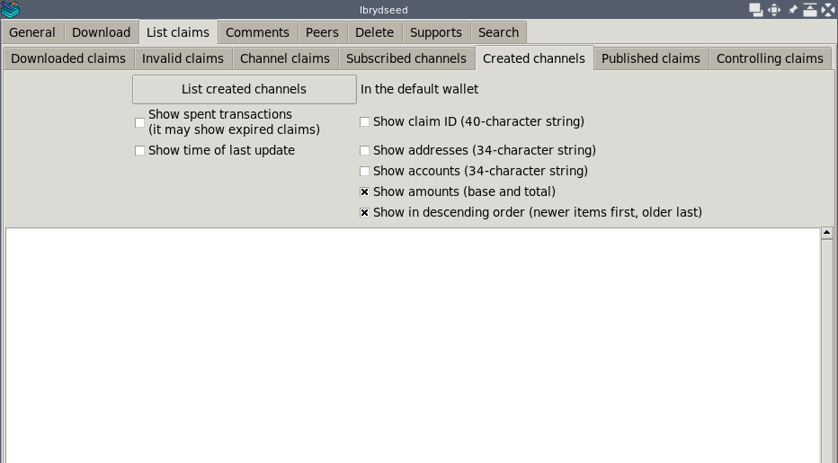
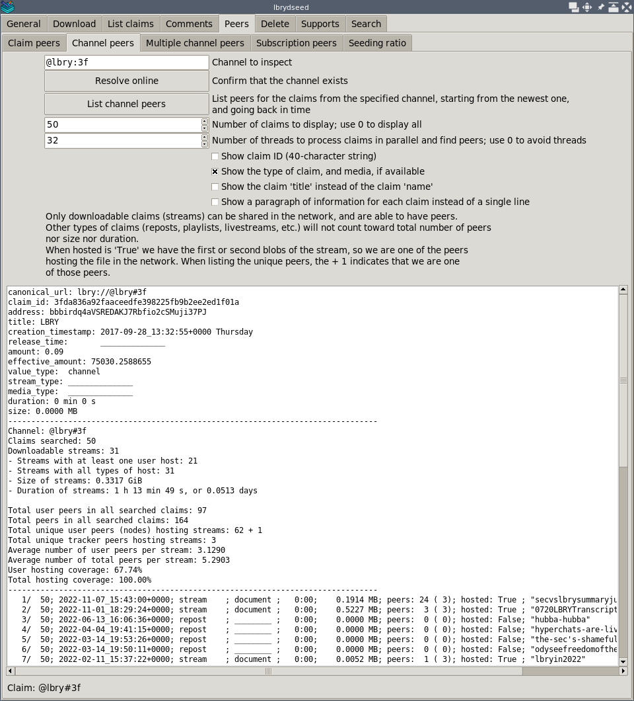
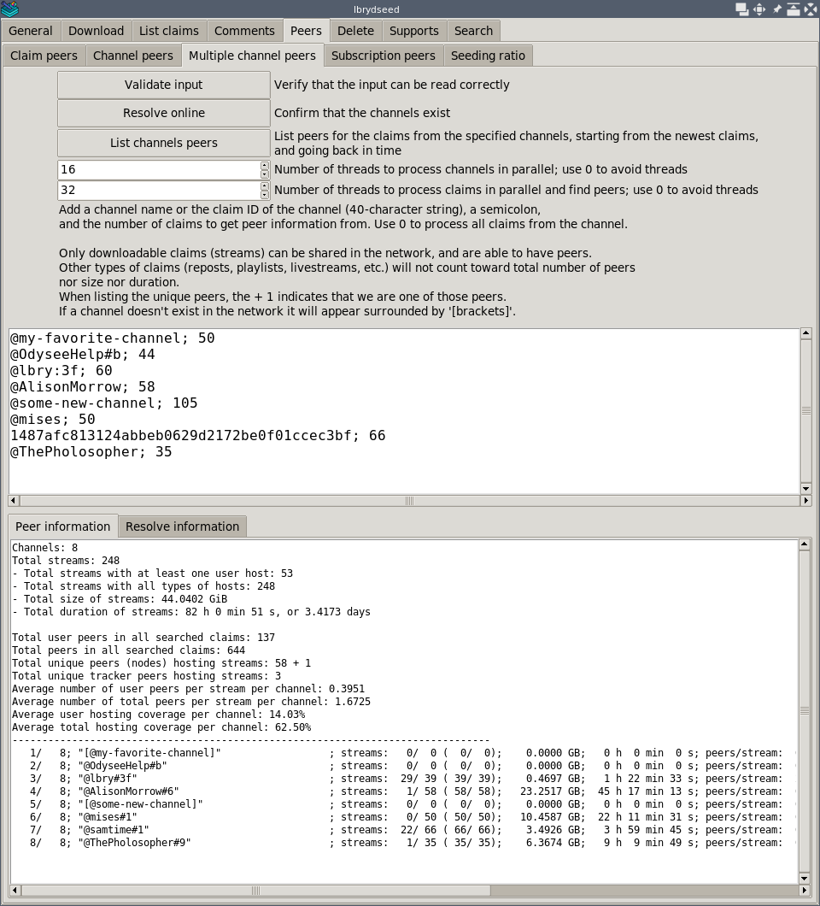
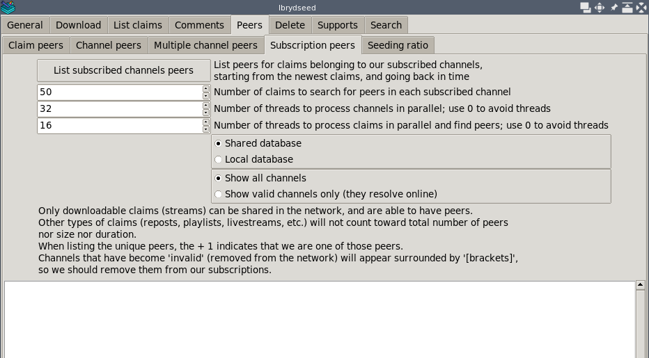
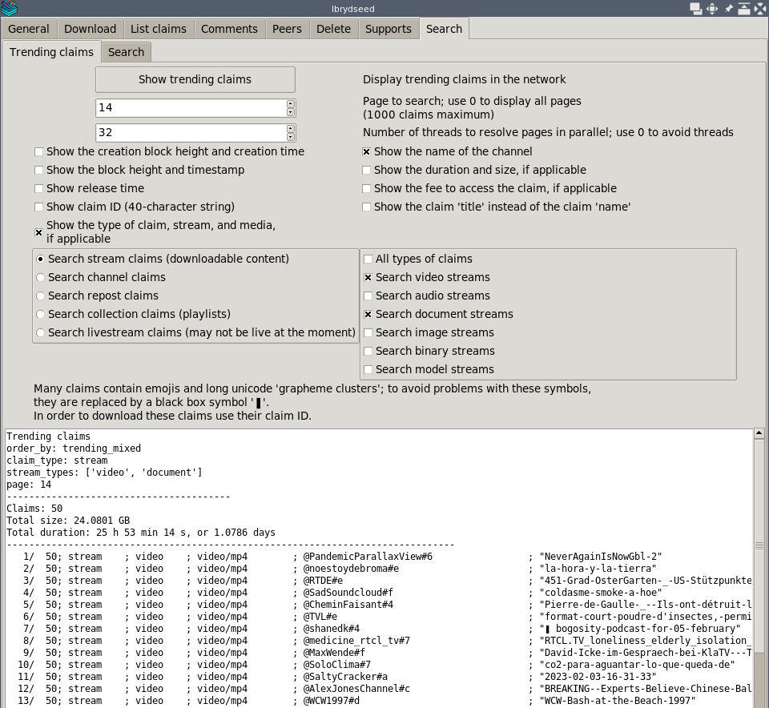
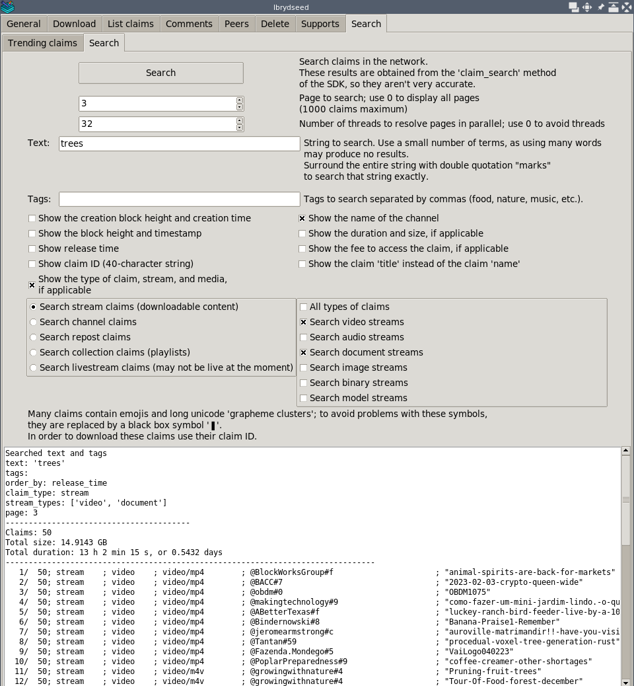

# Usage

Go back to the [_README_](../README.md).

## Content

- [Downloading](#downloading)
- [Listing](#listing)
- [Peers](#peers)
- [Deleting](#deleting)
- [Supports](#supports)
- [Searching](#searching)
- [Advanced](#advanced)

## Downloading

Enter the name of the channels, and a number of claims to download for each,
then press `"Download channel claims"`.

Enter the name or claim ID of various claims,
and then press `"Download claims"`.

[Go back to _Content_](#content)

## Listing

Press `"List download claims"` to display all claims downloaded to the system.

Press `"List invalid claims"` to display all invalid claims,
previously downloaded but no longer available online.

Press `"List channel claims"` to display all claims from a single channel.

Press `"List subscribed channels"` to list the subscribed channels
that are in our wallet file.
Press `"List subscribed channels claims"` to list the latest claims
from each of our subscribed channels.

Press `"List created channels"` to display the channels that were defined
with the current wallet.

Press `"List published claims"` to display the claims that were defined
with the current wallet, under a channel or outside of it (anonymously).

[Go back to _Content_](#content)

## Peers

Press `"List channel peers"` to show the peer information
for the latest claims from the indicated channel.

Press `"List channels peers"` to show the peer information
for the latest claims from the indicated channels.

Press `"List subscribed channels peers"` to show the peer information
for the latest claims of the channels in our subscription list.

[Go back to _Content_](#content)

## Deleting

Enter the name or claim ID of various claims, then press `"Delete claims"`.

Enter the name of the channels, and a number of claims to keep for each,
then press `"Clean up claims"`.

[Go back to _Content_](#content)

## Supports

Press `"List supports"` to show claims that we support with LBC.

Enter the name or claim ID of various claims (it can be any type of claim
such as videos and channels), a number,
and then press `"Add or remove support"`.

[Go back to _Content_](#content)

## Searching

Press `"Show trending claims"` to show the claims that are trending
on the network at the moment.

Press `"Search"` to search the string, and tags, if any.
At the moment, the search functionality is very basic, so using simple words
is better than long sentences.

[Go back to _Content_](#content)

## Advanced

Press `"Display seeding ratio"` to show an estimate of the blobs uploaded
and downloaded.

Press `"Display controlling claims"` to show our published claims,
and whether they are "controlling", meaning that they have the highest bid
for their name.

[Go back to _Content_](#content)
